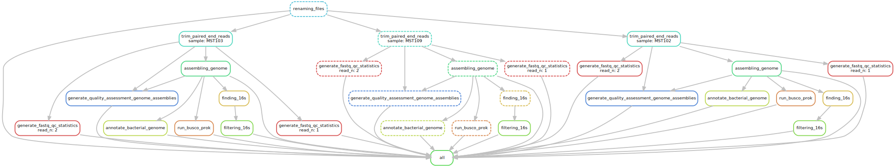

# Snakemake workflow: `Snakemake Pipeline for Illumina Raw Data`

[](https://snakemake.github.io)
[](https://github.com/currocam/IlluminaSnakemake/actions?query=branch%3Amain+workflow%3ATests)

A Snakemake workflow for raw illumine reads to draft assemblies and annotations

## Setting up Snakemake

### Cloning repository

```bash
git clone https://github.com/currocam/IlluminaSnakemake
cd IlluminaSnakemake
```

### Activating Conda environment

```bash
conda activate sm_wgs
```

### Fixing BUSCO requirement for parallelization

```bash
export NUMEXPR_MAX_THREADS=100
```

## Quick start

Just the most common commands you may be using all the time. Given that raw data are in the `reads` directory inside `IlluminaSnakemake`, run the following command to rename the files:

```bash
snakemake -c8 rename
```

Then, run the following to display what would be done (taking only the file modification date into account for deciding if a substep should be re-runned):

```bash
snakemake -n -rerun-triggers mtime
```

If it looks okay, just run it by specifying the maximum number of threads the pipeline can use (although single steps are forced to a maximum of 0.75 * `MAX_CORES`)

```bash
snakemake -c75 -rerun-triggers mtime
```

This will probably take a while. You may want to check the log files for each subprocess while are being written inside the `logs` directory. 

## Usage

First of all, let's inspect the directory structure **before** you run Snakemake, just after you clone this repository:

```bash
$ tree -L 2
.
├── LICENSE
├── README.md # You're reading this file rigth now
├── config
│   ├── README.md # How to configurate the pipeline
│   └── config.yaml # Where you're going to configurate the pipeline
├── enviroment.yaml # List of dependencies
└── workflow # Where the actual code is written
    ├── Snakefile
    └── envs
```

The script expects a directory named `reads` where the raw Illumina `fastq.gz` files should be moved into. Please check [`config/README.md`](config/README.md) for changing this default behavior. Files should be named as follows:

### Renaming files

The first step is to rename the different files to just display the sample and the read. You can do this manually or run the following command. In case of renaming files manually, you should move them into the `results/renamed_raw_reads` (or edit the `config.yaml` file). 

```bash
snakemake -c1 rename
```

### Running snakemake

Snakemake has a large `-help` documentation, which can be accessed as follows:

```bash
snakemake --help
```

Here, we'll see only the ones I have found more interesting. First of all, you may run a `dry-run` (to display what would be done)

```bash
snakemake -n --quiet
```

Or a more detailed one, including files and the shell commands that will be executed (nice for debugging):

```bash
snakemake -p -n
```

To run the pipeline, you must indicate the number of maximum cores you want to dedicate to the pipeline:

```bash
snakemake -c 100
```

Any Snakemake pipeline can be visualized using `--dag` as follows

```bash
snakemake --dag | dot -Tsvg > docs/dag.svg
```



Let's inspect the directory structure **after** you run Snakemake. You may be aware that new directories have been created (in addition to `reads`, where we moved the raw data files previously).

```bash
tree -L 2
.
├── LICENSE
├── README.md
├── config
├── enviroment.yaml
├── logs # Log files inside are been updating with the stdout and stderr, in case you want to check how is everything going.
│   ├── busco
│   ├── fastqc
│   ├── prokka
│   ├── quast
│   ├── renaming
│   ├── spades
│   └── trim_galore
├── reads
├── results
│   ├── allfastqc
│   ├── busco
│   ├── prokka
│   ├── quast
│   ├── renamed_raw_reads
│   ├── spades
│   └── trimmed
└── workflow
    ├── Snakefile
    └── envs
```

### Comparing genomes

To compare genomes, you can use the `compare` rule. This rule uses dRep and checkM to compare different genomes. You can configure this tool in the config.yaml file (see [`config/README.md`](config/README.md) ). 

There are 2 modes: by default, all samples are compared. 

```bash
snakemake -c50 compare
```
However, it may be useful to compare only a number of genomes with each other. In this case, the pipeline expects a file with as many lines as files and their respective addresses. For example, 

```bash
cat subsample1.txt 
results/spades/MST103_spades/MST103_contigs.fasta
results/spades/MST104_spades/MST104_contigs.fasta
results/spades/MST102_spades/MST102_contigs.fasta
```
Then, you need to indicate the file you are going to use (you can also do it by editing  [`config/config.yaml`](config/config.yaml))

```bash
snakemake -c50 compare --config SAMPLES_TO_COMPARE_FILEPATH="subsample1.txt"
```

Let's see the file structure resulting from running `compare` with all the files and with a subsample

``` bash
results/dRep/
├── all
│   ├── data
│   │   ├── Clustering_files
│   │   ├── MASH_files
│   │   └── fastANI_files
│   ├── data_tables
│   ├── dereplicated_genomes
│   ├── figures
│   └── log
└── subsample1
    ├── data
    │   ├── Clustering_files
    │   ├── MASH_files
    │   └── fastANI_files
    ├── data_tables
    ├── dereplicated_genomes
    ├── figures
    └── log
```

## Custom installation

### Creating an environment from a YAML file

First, make sure to activate the Conda base environment with

```bash
conda activate base
```

The `environment.yaml` file can be used to install all required software into an isolated Conda environment with the name `sm_wgs` via:

```bash
mamba env create --name sm_wgs --file environment.yaml
```

O, using Conda:

```bash
conda env create --name sm_wgs --file environment.yaml
```

## A few considerations for dealing with unexpected behavior

Because of Snakemake's way of deciding whether a step needs to be rerun, you may encounter undesired behavior. For example, rerunning an entire pipeline after modifying a single parameter (which only affects one of the final steps), moving a directory, or adding new reads.

If this happens (it will be reflected when using `snakemake -n` to view the schedule), there are some useful flags. As a rule of thumb, the desired effect is achieved by taking only the file modification date into account:

```bash
snakemake -n --rerun-triggers mtime
snakemake -c100 --rerun-triggers mtime
```

Another command of interest is `--touch`:

> Touch output files (mark them up to date without really changing them) instead of running their commands. This is used to pretend that the rules were executed, in order to fool future invocations of snakemake. Note that this will only touch files that would otherwise be recreated by Snakemake (e.g. because their input files are newer). For enforcing a touch, combine this with `--force`, `--forceall`, or` --forcerun`. Note however that you loose the provenance information when the files have been created in realitiy. Hence, this should be used only as a last resort. (default: False) (note that you can touch individual files, obtaining the same effect).

As a last resort, you can always delete the folder with the results of the step you want to rerun and then run Snakemake normally.

## Tips to test different parameters

It is very important to note that, if we are only interested in getting one file, we can tell Snakemake directly.

For example, let's imagine that we want to rerun the 16s sequence fetch because, with the restrictions imposed, we have not obtained any sequence. To re-run the filtering step with a different minimum number of bp just for one file (without affecting other samples):

```bash
grep -c '>' results/barrnap/MST109_filtered_rrna.fa
1 # Just one sequence

snakemake -n results/barrnap/MST109_filtered_rrna.fa --rerun-triggers mtime
Building DAG of jobs...
Nothing to be done (all requested files are present and up to date). # Expected behavior

rm results/barrnap/MST109_filtered_rrna.fa
snakemake -c1 results/barrnap/MST109_filtered_rrna.fa --rerun-triggers mtime --config minumun_16s_allowed=0
grep -c '>' results/barrnap/MST109_filtered_rrna.fa
9
```

Another very useful tool is `--summary`, which prints a table associating each output file with the rule used to generate it, the creation date, and, optionally, the version of the tool used for creation. This flag, in addition, to grep, can be very useful for checking the status of files. 

```bash
snakemake --summary --rerun-triggers mtime | grep 'contigs.fasta'
    
Building DAG of jobs...
results/spades/MST103_spades/MST103_contigs.fasta       Sat Sep 10 10:44:32 2022        assembling_genome       -       logs/spades/MST103.log    ok      no update
results/spades/MST109_spades/MST109_contigs.fasta       Sat Sep 10 09:57:56 2022        assembling_genome       -       logs/spades/MST109.log    ok      no update
results/spades/MST102_spades/MST102_contigs.fasta       Sat Sep 10 10:35:02 2022        assembling_genome       -       logs/spades/MST102.log    ok      no update
```